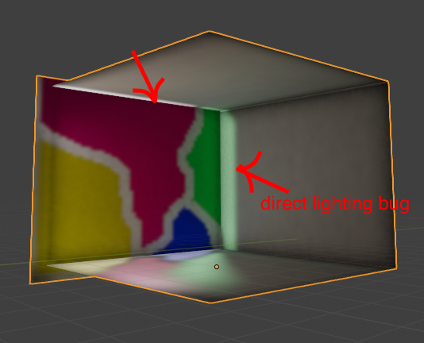
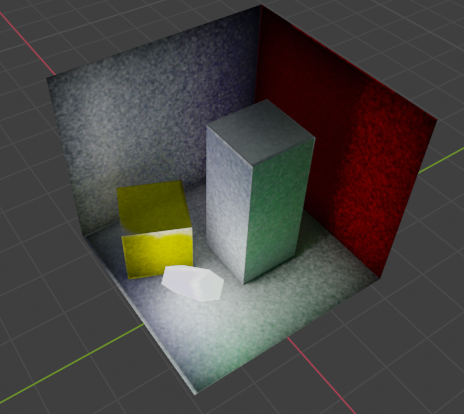
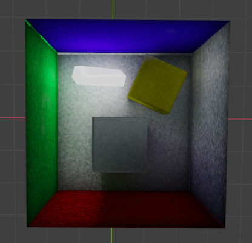
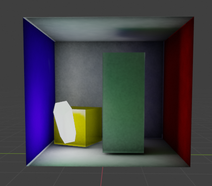
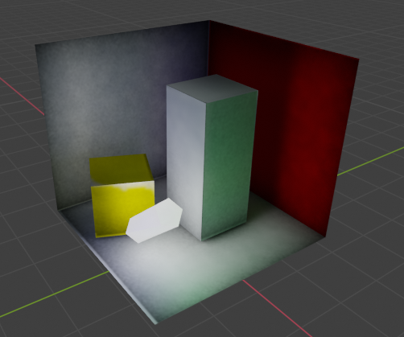
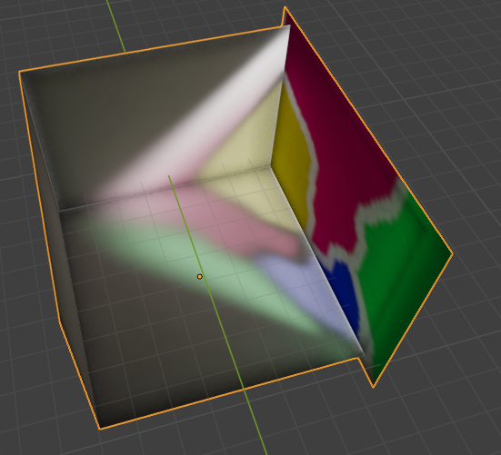
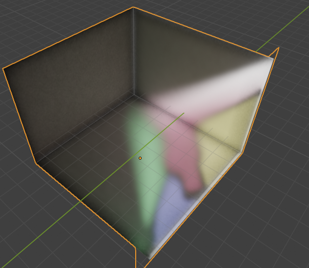

# LMB

LMB is a c++ library that bakes lightmaps.
The library is flexible and extendable and it also supports multithreading.
LMB supports direct lighting, ambient occlusion,
indirect lighting, denoising and more to come in the future.You can also extend the features on your own fairly easily.


# Third Party Libraries

* STD:
    * link: https://github.com/nothings/stb
    * license (MIT): https://github.com/nothings/stb/blob/master/LICENSE

* Imgui:
    * link: https://github.com/ocornut/imgui
    * license (MIT): https://github.com/ocornut/imgui/blob/master/LICENSE.txt
* Glm:
    * link: https://github.com/g-truc/glm
    * license (MIT): https://github.com/g-truc/glm/blob/master/manual.md#section0
* OBJ loader:
    * link: https://github.com/Bly7/OBJ-Loader
    * license (MIT): https://github.com/Bly7/OBJ-Loader/blob/master/LICENSE.txt
* SDL2:
    * link: https://www.libsdl.org/
    * license (ZLib): https://www.libsdl.org/license.php


# Known Bugs

* Light leak from directional light on transparent surface:
    


# Build

1. Copy glm,SDL2,stb include folder to location third_party/includes/

2. Copy SDL2 bin library to location third_party/libs/SDL2/


Release build:

    $ sh build_release.sh

Debug build:

    $ sh build_debug.sh

CMake build:
    
    cmake -S ./ -B build/


# Usage

Example: src/lmb_example/

Example how to calculate ao:

```cpp

#include <lmb/lmb.h>

int main()
{
    //initiate library
    LMB::Init();

    //create a lmb session
    auto lmb_session = 
    std::make_shared<LMB::LMBSession>();

    //create a solver
    auto solver = 
    std::make_shared<LMB::KDTreeSolver>();

    //create calculator
    auto calc_ao =
    std::make_shared<LMB::AOCalculator>(default_ao_config);

    //set the blending function
    calc_ao->SetBlend(std::make_shared<LMB::CalcBlendSet>());

    //set the solver and calculator
    //!if you already set a solver/calculator on another lmb session the solver/calculator wont be set
    lmb_session->SetSolver(solver);
    lmb_session->SetCalculator(calc_ao);

    //starts calculating async
    lmb_session->StartCalc();

    //waits for the end of calculation
    lmb_session->EndCalc();

    //you can use lmb_session->GetLightmaps() to get the final lightmaps


    //terminate library
    LMB::Term();

    return 0;
}

```

# Result Screen Shots

* Direct lighting,Indirect lighting,Ambient Occlusion:
    
    
* Direct lighting,Indirect lighting,Ambient Occlusion,Denoising:
    
    
* Direct lighting,Indirect lighting,Ambient Occlusion,Denoising,Transparency:
    
    
